# Plateforme ENEAM - Magasin

**Auteur :** MIGAN Issa  
**Filière :** Informatique de Gestion - IG2B  
**École :** ENEAM

---

## Aperçu
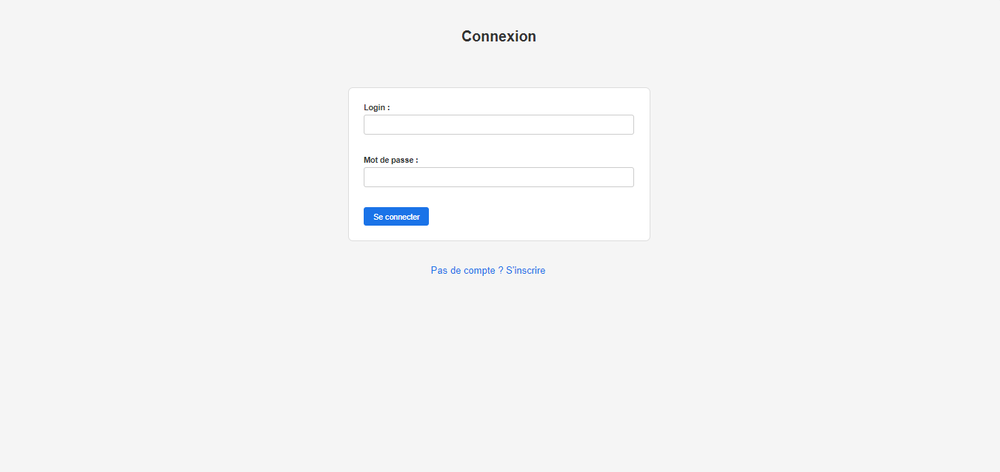
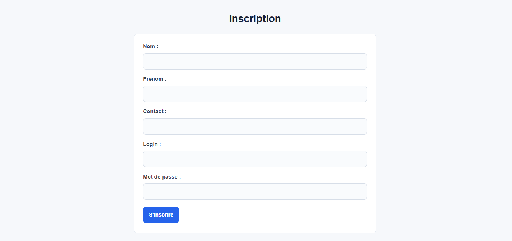
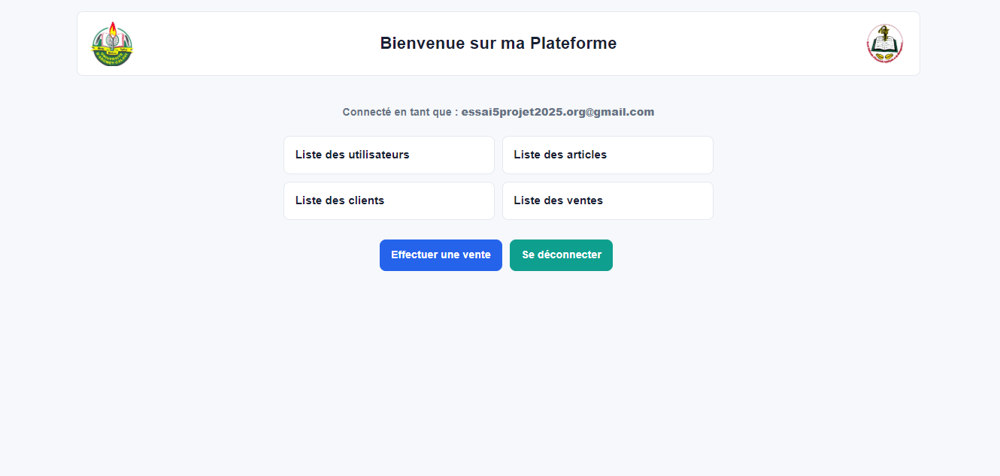

Plateforme web de gestion d'un magasin développée en PHP et MySQL.

---

## Fonctionnalités

- Connexion et inscription des utilisateurs
- Gestion des articles, clients et ventes
- Affichage des listes avec tableaux
- Effectuer une vente (commande + contenir)

---

## Structure du projet

```
essaiBDD/
├── img/
├── index.php
├── register.php
├── accueil.php
├── listearticle.php
├── listeclient.php
├── listeusers.php
├── listevente.php
├── formulaire.php
├── ajoutclient.php
├── vente.php
├── logout.php
├── exemple15-2.php
├── exemple15-4.php
├── myparam.inc.php
└── style.css
```

---

## Base de données

**Nom :** `essaiBDD`  
**Tables :** `client`, `article`, `commande`, `contenir`, `users`

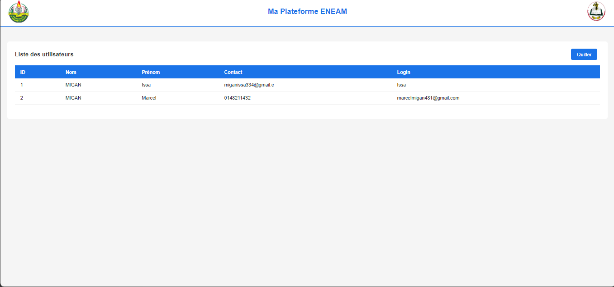
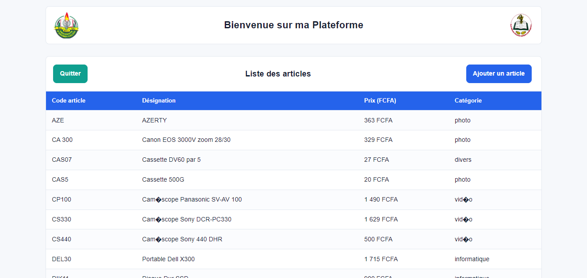
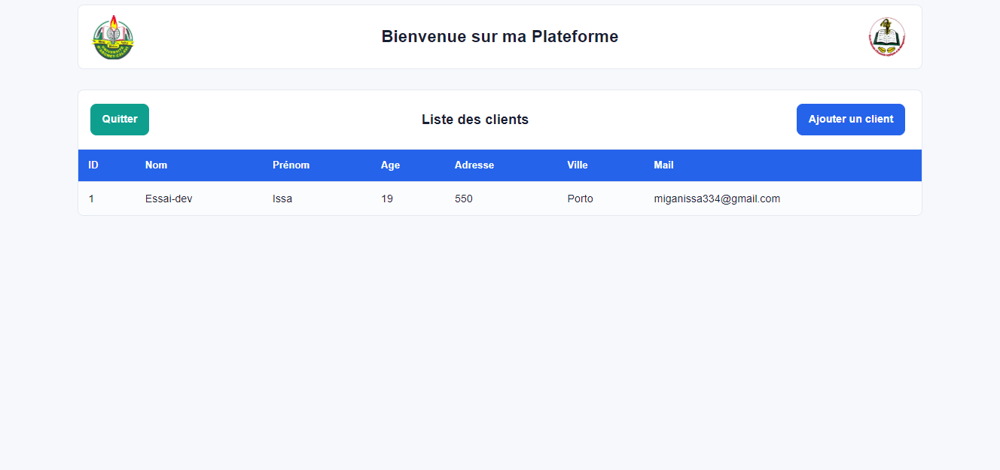
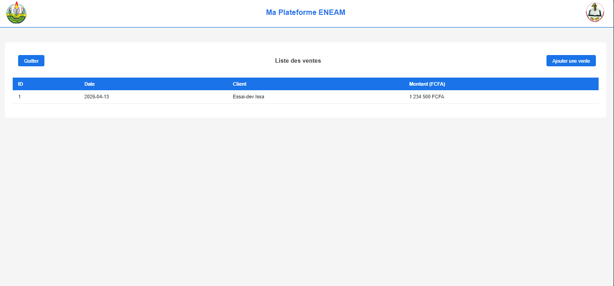
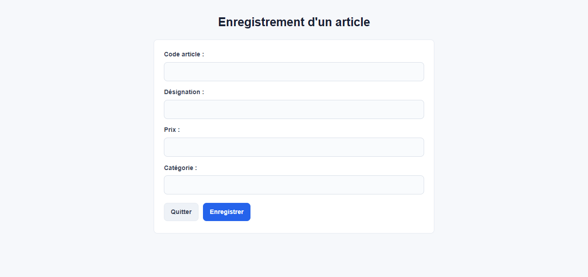
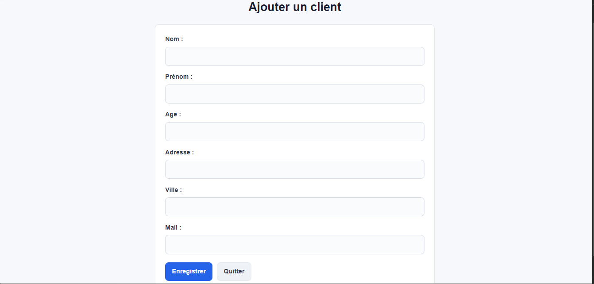
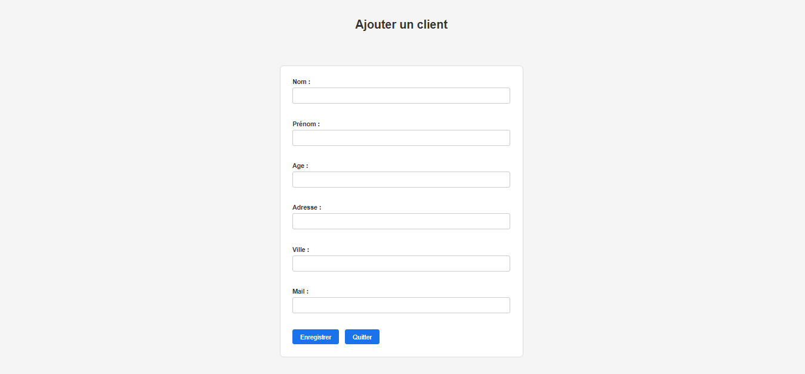
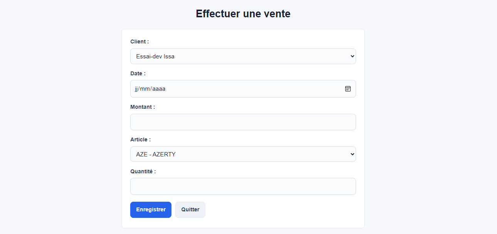
---

## Installation

1. Copier le dossier dans `C:\xampp\htdocs\`
2. Créer la base `essaiBDD` dans phpMyAdmin
3. Importer le fichier SQL
4. Lancer : `http://localhost/essaiBDD/`

---

## Technologies

- PHP 8
- MySQL / phpMyAdmin
- HTML / CSS
- XAMPP
